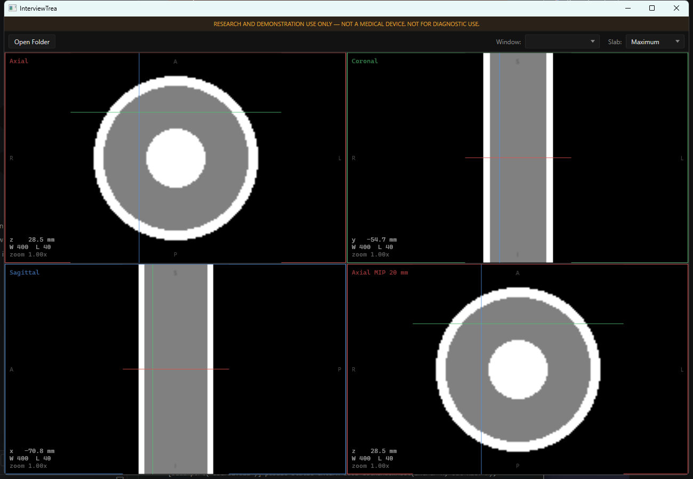

# InterviewTrea

> **RESEARCH AND DEMONSTRATION USE ONLY — NOT A MEDICAL DEVICE. NOT FOR DIAGNOSTIC USE.**

An independent study project. **No affiliation with, endorsement by, or code derived from
any commercial vendor.** The name is a pun; nothing here is anyone's product.

## What this is

A Windows desktop CT visualization workstation in C#/WPF. It loads a DICOM series from a
local folder, reconstructs a 3D volume of Hounsfield units, and renders synchronized
axial, coronal and sagittal multiplanar reformats with slab projection, oblique
reslicing, and patient-space measurement. The interesting part is that the geometry,
interpolation and reslicing are written by hand rather than delegated to ITK or VTK —
that is the point of the exercise, not an oversight.

## Status

**Iteration 3 of 5 complete.** A folder of DICOM becomes a validated `Volume`, or a clear
typed rejection naming the rule that failed. Four viewports show axial, coronal, sagittal
and a slab projection of the same patient-space point; clicking in any of them moves the
other three. All three NFR-200 performance targets are met — see
[docs/performance.md](docs/performance.md).



*Synthetic phantom, 128 x 128 x 60 at 0.7 x 0.7 x 3.0 mm. No patient data appears anywhere
in this repository.*

| Iteration | Goal | State |
|---|---|---|
| 1 | Folder of DICOM to validated `Volume` | Done, pending the acceptance run against real data |
| 2 | Single axial viewport, scroll, window/level | Done |
| 3 | 2x2 MPR with linked crosshairs | Done |
| 4 | Measurement and oblique reslicing | Not started |
| 5 | Plugin platform and polish | Not started |

## Build and run

Requires the **.NET 8 SDK** (pinned in `global.json`).

```
dotnet build -warnaserror
dotnet test
```

```
dotnet run --project src/InterviewTrea.App
dotnet run --project src/InterviewTrea.App -- data/<your study folder>
```

The optional folder argument skips the dialog. It exists as a demo safeguard: on an
unfamiliar machine, clicking through a folder picker to a path you have not memorised is
the easiest way to lose thirty seconds of a ten-minute slot.

The Iteration 1 console probe exercises the same load pipeline with no window at all,
which is how the composition root got tested before there was a UI to hide it:

```
dotnet run --project tools/InterviewTrea.Probe -- data/<your study folder>
```

It prints what was loaded, or why the series was refused, and sanity-checks that air
reads about -1000 HU.

## Test data

**No DICOM is committed to this repository.** `data/` is gitignored and the test suite
runs entirely against datasets synthesised in memory, so a clean clone passes
`dotnet test` with no downloads.

For the acceptance check you need one real study. See **[docs/data-setup.md](docs/data-setup.md)**
— it names the collection (LIDC-IDRI on The Cancer Imaging Archive), the retrieval
procedure, and the table recording which series were actually used.

Public collections are de-identified by their publishers. No other patient data goes
near this project, ever.

## Architecture

Dependencies point one way. The rule is enforced by target framework, not by convention:
every library targets plain `net8.0`, so WPF types are not merely discouraged in the
rendering and geometry code, they do not exist in the compilation.

**Controls.** Left-click or drag sets the crosshair and moves the other three views with
it. Wheel scrolls that view along its own normal, by the volume's real spacing in that
direction. Right-drag sets window and level, middle-drag pans, Ctrl+wheel zooms about the
cursor, Shift+wheel over the slab pane sets its thickness, and double-click maximizes a
pane or restores the grid. The only visible chrome is the regulatory banner, the Open
Folder button, and the window and slab dropdowns — everything else is a gesture, and every
value it changes is shown in the pane's own overlay.

```
InterviewTrea.Core            depends on nothing
        ^
        |-- InterviewTrea.Dicom          Core only. fo-dicom appears here and nowhere else.
        |-- InterviewTrea.Rendering      Core only. Produces byte[]. Never System.Windows.*
        |-- InterviewTrea.Applications.Abstractions   Core only. The plugin contract.          (It. 5)
                ^
                |-- InterviewTrea.App    depends on everything. Nothing depends on it.
```

`Applications.Abstractions` does not exist yet. `InterviewTrea.App` is the only project
targeting `net8.0-windows`; every other one targets plain `net8.0`, which is what makes
the rule enforceable rather than aspirational.

Volume storage is a flat `short[]` of Hounsfield units with x varying fastest. A
512x512x400 chest study is 200 MB, which is what buys the memory budget; `float` would
double it for no gain, since CT is integer data.

## Testing

Coverage is targeted at the domain and rendering layers — geometry, volume sampling,
DICOM parsing, validation, reslicing — where a defect is silent and the return on a test
is highest. **The view layer is deliberately left to manual verification.** XAML bindings
and view construction are not unit tested, because that is where the return on test
investment collapses and chasing the number would produce tests that assert the
framework works.

Numeric tests use analytically derived expected values, never snapshots or golden files.
A trilinear sample at the midpoint of a 0-to-1000 HU ramp is asserted to be 500 because
that is what interpolation means, not because that is what the code returned the first
time it ran.

The standing verification discipline is mutation: a green test proves nothing until a
deliberate break makes it red. Where a mutation survived, that is recorded in the AI
assistance log along with the gap it exposed.

## Documents

- [Phase 1 specification](docs/INTERVIEWTREA-PHASE1-VIEWER.md) — the viewer platform
- [Phase 2 specification](docs/INTERVIEWTREA-PHASE2-CALCIUM-SCORING.md) — the calcium scoring plugin
- [Traceability matrix](docs/traceability.md) — every requirement, its design element, its test
- [Architecture decisions](docs/decisions/) — one ADR per genuinely contested call
- [AI assistance log](docs/ai-assistance-log.md) — including where the assistant was wrong and was caught
- [Test data setup](docs/data-setup.md)
- [Performance](docs/performance.md) — the NFR-200 targets, measured, with before and after

## Known limitations

Stated plainly, because a vague limitations section is worse than none.

- **A tilted gantry is rejected, not corrected.** Correcting it means resampling onto a
  sheared grid, which is out of scope. The tilt tolerance is roughly 2.5 degrees and has
  only been exercised against synthetic tilt; it wants tuning against a real tilted
  series. See [ADR-001](docs/decisions/ADR-001.md).
- **Non-uniform slice spacing is rejected rather than interpolated.** A study with a
  dropped slice or a duplicate will not load. The message says which.
- **CT only, single-frame only, 16-bit pixel data only.** Enhanced/multi-frame objects
  are refused explicitly rather than mis-parsed as single slices.
- **Compressed transfer syntaxes beyond RLE are not decoded.** fo-dicom handles
  uncompressed and RLE natively; JPEG and JPEG-2000 would need `fo-dicom.Codecs`, which
  is deliberately not referenced until a real series needs it.
- **The performance requirement (400 slices in under 15 seconds) is unverified.** It is
  not measurable without real data and no test has been fabricated for it. It is marked
  `Blocked` in the traceability matrix rather than assumed.
- **The peak-memory bound holds by construction, not by measurement.** Slices decode
  directly into the final array with nothing copied, but it has not been profiled.
- **Reslicing is axis-aligned so far.** The renderer takes an arbitrary plane and the
  geometry for a rotated one is already in place, but nothing rotates it yet: oblique
  reslicing by dragging a crosshair arm (FR-307) is Iteration 4.
- **A folder with several series loads the largest without asking.** FR-102 wants a
  prompt; the picker is not yet in the approved control set.
- **One optimization is missing an explanation, not a measurement.** Removing a duplicated
  bounds test from the slab loop made it 43% slower, reproducibly, and neither of the two
  hypotheses tested accounts for it. It was reverted and the measurement recorded rather
  than a guess. See [docs/performance.md](docs/performance.md).
- No PACS or DICOMweb connectivity, no volume rendering, no curved MPR, no multi-study
  comparison, no non-CT modalities. These are deliberate non-goals, not gaps.
